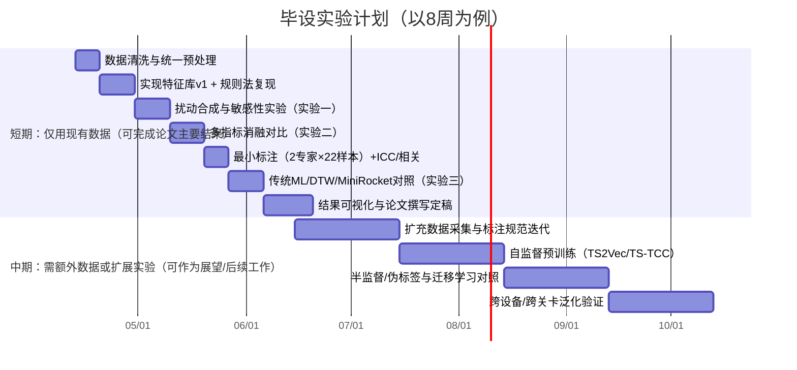

# 基于触控笔轨迹与压力数据的迷宫与对称绘图自动评估研究报告

## 执行摘要

你当前的毕业设计处在一个典型但可“论文化”的研究场景：数据量极小（圆形迷宫8、方形迷宫6、对称画8，共22份），每份只有透明底轨迹图与对应的点序列+笔尖压力txt；没有病理/诊断标签；现有评分依赖导师专家规则但缺少文献支撑；现有非深度算法效果不佳；同时又需要设计能支撑论文结论的对比实验，并规划后续深度学习路线。fileciteturn0file0

本报告给出一条可行且更“严谨可答辩”的研究重构路径：**将目标从“诊断书写障碍/病理识别”收敛为“基于数字笔数据的结构化任务表现量化评估（quality assessment）与可解释评分”**。原因是：临床/教育诊断（如DSM-5的特定学习障碍、ICD-11的发育性学习障碍）需要明确的临床综合判定与排除条件，仅靠22条轨迹不可能进行可靠诊断建模；但“表现评估/训练反馈”可以用更少样本开展**构念效度、规则效度、可解释特征与模型对照**，更适合作为本科毕设论文的核心论证。citeturn8search1turn8search27turn8search15

本报告的核心交付包括：  
第一，建立**文献支持的指标框架**：把你现有规则拆成可与文献对齐的维度（形状/准确度、边界安全、线控平滑、连续性/分段、压力控制、异常行为），并指出哪些阈值与权重目前缺乏循证依据、应如何用数据与统计方法校准。fileciteturn0file0turn0file1turn0file2  
第二，给出**短期可完成的对比实验**（不依赖病理标签）：  
- “规则—特征”一致性与敏感性实验（通过可控扰动生成伪真值）、  
- 多种候选相似度/平滑度/越界度量的消融对比、  
- 小样本下的稳健统计检验与可视化模板。citeturn6search4turn6search1turn10search0  
第三，规划**中期深度学习路线**：自监督/无监督表征学习（TS2Vec、TS-TCC、TNC等）+少量标注微调；以及半监督伪标签（FixMatch思路）与合成数据策略，并给出具体超参范围与开源实现入口。citeturn4search0turn4search9turn3search7  
第四，提出**标注与验证集构建方案**：小样本条件下建议采用“多专家、分维度、等级量表+一致性训练+ICC/κ评估”，并给出用于统计显著性/相关性检验的样本量估算方法与目标规模。citeturn6search3turn12search0turn12search6turn12search15

---

## 数据现状与研究问题重构

你的数据由三类结构化任务组成：圆形迷宫轨迹8份、方形迷宫轨迹6份、对称画8份；每份包含透明底轨迹图与txt（像素点序列与笔尖压力）。fileciteturn0file0 设备为Wacom电磁笔，具备压力感应与高报点率（文档中强调>300报点率）。fileciteturn0file1turn0file2

### 为什么不建议把论文目标写成“书写障碍诊断模型”

临床/教育领域对“学习障碍/书面表达受损/书写障碍（dysgraphia）”的诊断强调：持续性困难、功能受损、与年龄/智力不匹配、排除其他神经发育/感觉/教育机会等因素，并需要综合病史、测验、教师观察等信息；DSM-5也明确这是一个需要临床综合审查的诊断过程。citeturn8search1turn8search15turn8search19 ICD-11同样将“发育性学习障碍”置于神经发育障碍框架，并有更细分条目（如书面表达受损）。citeturn8search27turn8search16turn8search8  
在仅22条轨迹、且无任何病理标签/常模参照的条件下，做“诊断分类”不仅统计上不可行，也容易在答辩中被质疑伦理与科学性。

### 建议的论文主问题表述

建议将主问题表述为类似：

**“面向儿童书写/绘画训练的触控笔在线轨迹数据：在小样本、少标注条件下，如何构建可解释、可对比、可复现的自动化表现评估指标体系与评分算法，并验证其构念效度与一致性？”**fileciteturn0file0

这样可以自然承接你现有系统流程（图像预处理→规则评分→结果评估→尝试深度模型）。fileciteturn0file0 同时也与文献中“数字化书写评估工具/多维特征量化/用于筛查与课堂快速评估”等研究方向一致。citeturn1search7turn0search12turn1search29

---

## 相关领域综述与可复现参考体系

这一部分按“临床/教育测评框架—数字笔特征工程—迷宫/绘图任务—小样本与自监督”四条线梳理，并在文末给出可复现/权威文献清单（≥15篇）。

### 临床与教育测评中“书写/绘图能力”常见构念

1) **书写困难/书写障碍评估工具并不统一**。针对发育性协调障碍（DCD）儿童的书写评估，文献强调“工具繁多但缺乏统一金标准”，且工具可能评估书写质量、速度或过程指标的不同侧面。citeturn1search13turn1search2turn1search17  
2) **BHK**（Concise Evaluation Scale for Children’s Handwriting）是欧洲研究中常用的标准化工具之一，用于评价书写质量与速度；不少数字化研究让儿童在平板上完成BHK抄写任务并提取多维特征。citeturn1search19turn0search12turn1search26  
3) **Beery VMI**属于视觉—运动整合的经典测验，核心任务是“复制几何图形”，与“对称画/形状复现”在构念上高度相关，可作为你论文对称绘图任务的权威参照来源之一。citeturn1search9turn1search5turn1search16  
4) ICF（国际功能、残疾与健康分类）提供“功能—活动—参与”的框架，对你的论文写“面向功能表现评估（而非诊断）”很有帮助：你可以把迷宫与对称绘图视作“活动层面的表现任务”，而非直接映射为疾病标签。citeturn8search3turn8search12turn8search17

### 数字笔在线数据在书写评估中的常见特征维度

数字化/在线手写研究普遍将特征分为：**静态/空间（static/spatial）、运动学（kinematic：速度、加速度等）、时间（temporal：用时、停顿等）、动力学或动态（dynamic：压力、倾角等）、频域/谱特征**。citeturn0search12turn1search29turn1search25turn0search5  
例如，Asselborn等在使用消费级平板进行发育性书写障碍自动诊断时，从数字笔数据中提取了大规模特征并用随机森林取得高诊断性能（该工作也强调数字笔能捕获传统纸笔忽略的动态特征）。citeturn0search12turn0search8  
在更大样本的“iPad+压力/倾角”等研究中，研究者同样计算几十个特征并讨论不同年级/人群的差异。citeturn0search1turn1search26turn0search5  
近期综述也系统整理了用于发育性书写障碍分析的工具与方法，并重申“没有全球统一金标准、不同工具关注成品或过程不同侧面”。citeturn1search28turn1search17turn0search27

对你而言，这意味着：你导师提出的“准确度、线控、连续性、异常行为”等维度并不是拍脑袋，它们能与文献中的多维特征类别自然对齐；真正缺的是**阈值/权重的循证校准方法**，而不是维度本身。

### 迷宫与绘图任务在认知与运动评估中的位置

迷宫类任务在神经心理测评中长期用于评估计划、前瞻与执行功能；如Porteus Maze Test被描述为测量执行功能（planning/foresight）的工具。citeturn0search2turn0search13  
你当前的“走迷宫”规则中包含“是否走出、走错/回退、停滞”等策略性指标，和传统迷宫测评强调的规划与错误行为记录在逻辑上是兼容的。fileciteturn0file2turn0file0

另外，公开数据集中常见的“螺旋/波形/蛇形（meander）绘制”被用于帕金森等运动障碍研究；UCI也提供基于Wacom采集的“螺旋绘制”在线数据集入口。这类公开数据可作为你中期深度学习预训练或方法复现的外部数据来源（即便人群不同，也能用于学习通用笔迹动力学表征）。citeturn2search32turn2search16turn2search12

### 小样本与无标签学习的可复现方法谱系

1) **评估方法学**：小样本下最容易犯的错误是“调参/特征选择泄漏到测试集”，导致过乐观结论；经典文献明确指出应使用嵌套交叉验证来降低偏差，且“所有训练步骤必须放在CV循环内”。citeturn6search4turn6search1turn6search0  
2) **自监督时间序列表征学习**：TS2Vec、TS-TCC、TNC等方法在没有标签时通过对比学习/邻域一致性学习得到可迁移表征，并公开了论文与代码，适合你中期路线。citeturn4search0turn4search9turn4search3turn0search26  
3) **半监督与伪标签**：FixMatch把“一致性正则+高置信伪标签”做成了非常可复现的基线，拥有论文与官方开源实现；你可以借鉴其思想到轨迹图像或序列任务上。citeturn3search7turn3search3  
4) **少样本学习**：Prototypical Networks、MAML等是少样本学习的标准方法与常引基线，并有公开代码。citeturn5search2turn5search3turn5search14turn5search19

### 可复现或权威参考文献清单

为满足“≥15篇、优先原始论文/综述/标准”的要求，建议你在论文参考文献中至少覆盖以下类别（这里列出推荐“最小集合”，你可按需要扩充到25–40篇）：

- 临床/标准与框架：DSM-5学习障碍说明材料、WHO ICD-11与ICF、ICD-11精神/神经发育障碍临床描述手册、WHO AI伦理。citeturn8search1turn8search27turn8search3turn7search0  
- 书写/书写障碍数字化研究：Asselborn 2018（Nature npj Digital Medicine）、Danna/相关研究（PLOS ONE 2020）、Scientific Reports 2020/2022等、近期综述（MDPI Children 2023；PLOS scoping review 2024）。citeturn0search12turn0search5turn1search29turn1search28turn0search27  
- 国内综述：DCD儿童书写评估工具综述（中华实用儿科临床杂志 2025）。citeturn1search2  
- 迷宫测评参照：Porteus Maze相关资料（Springer条目/历史手册）。citeturn0search2turn0search13  
- 时间序列/对比学习：TS2Vec、TS-TCC、TNC及时间序列SSL综述。citeturn4search0turn4search9turn4search3turn4search2  
- 评估方法学（小样本CV偏差）：Varma & Simon、Cawley & Talbot。citeturn6search4turn6search1  
- 信度统计：ICC指南（Koo & Li）、ICC经典（Shrout & Fleiss）、样本量（Bonett 2002），以及κ（Cohen 1960/κ综述）。citeturn6search3turn12search6turn12search0turn12search15  
- 轨迹平滑/运动平滑度指标：平滑度指标综述（Frontiers 2018等）、最小jerk模型（Flash & Hogan）、Savitzky–Golay原始论文。citeturn10search0turn10search9turn11search0  
- 轨迹/形状相似度度量：DTW（Keogh & Ratanamahatana）、Hausdorff（Huttenlocher 1993）、Fréchet（Alt & Godau 1995）、Chamfer Matching（Barrow 1977）。citeturn2search11turn11search1turn11search2turn11search29

---

## 现有专家规则的文献对照与改进建议

你当前规则体系可概括为：

- 对称画：对称准确度（形状/关键点/过程位置/闭合）、线控能力（直线直/曲线平滑）、连续性与分段行为、异常乱画监测；并给出阈值（如形状/大小相似≥70%）与权重（如1B/1C/1D各30%、连续性10%等）。fileciteturn0file1turn0file0  
- 走迷宫：路径策略与进展（是否走出、正确路径覆盖、走错/回退）、边界安全（越界/触边比例）、线控能力、连续性与分段、异常乱画；并提出覆盖率阈值（如95%覆盖等）与比例倒扣分等想法。fileciteturn0file2turn0file0  

这些维度与数字笔文献中常见的“空间/静态、运动学、时间/停顿、压力/动力学、频域平滑”等构念高度一致，属于**合理的结构化评分框架**。citeturn0search12turn1search29turn0search5  
真正需要改进的是：**规则阈值、权重、以及“哪些特征能稳健反映该维度”的证据链**。

下面给出逐维度对照与改进建议（强调“能写进论文方法与讨论”的表达方式）。

### 对称准确度与形状匹配

**现有做法**：你实现中用“膨胀容差+像素级F1”计算形状相似，用外接框宽高比度量大小相似；关键点用网格交点与轨迹最近距离阈值；闭合性用反射/对比与F1下降来间接评估。fileciteturn0file0turn0file1  
**文献对照**：数字化书写/绘图研究普遍包含空间/静态特征（包含大小、形状、空间布局等）并用于区分人群或评估质量；BHK与VMI等工具本质上也在评价“产出图形/文字的质量与结构正确性”。citeturn0search12turn1search5turn1search19  
**主要问题**：  
- “70%相似度判对/错”目前更像工程阈值，缺乏常模或ROC校准依据。fileciteturn0file1  
- 像素级F1对笔画粗细、采样密度、轻微位移较敏感；如果不同样本画笔粗细/压力不同，会引入系统偏差。

**改进建议（可写成论文贡献点）**：  
1) 把“像素F1”扩展为一组对比指标（**F1/IoU + 距离型指标**）：  
- **Hausdorff距离**用于衡量两点集最大偏差，经典用于图像形状比较。citeturn11search1turn11search27  
- **Fréchet距离**考虑点序顺序，更适合曲线相似度。citeturn11search2turn9search11  
- **Chamfer Matching**是经典形状匹配策略，可用于“模板边缘 vs 轨迹点集”的平均最近距离。citeturn11search29turn9search13  
2) “阈值”不再写死：以**分位数/标准分**或**少量标注的ROC/相关性最大化**来确定（详见后文标注与样本量部分）。这一点在答辩时非常关键：你要把阈值从“拍脑袋”变成“数据驱动校准”。  
3) 关键点覆盖建议从“命中/不命中”升级为**软距离得分**：例如对每个关键点取到轨迹的最小距离d，得分定义为 `exp(-d^2/2σ^2)`，σ再通过数据或标注校准；这比硬阈值更稳健，也便于做连续回归模型。

### 线控能力与平滑度

**现有做法**：用抖动分析评估线条稳定性：将理想线段分段、计算轨迹点到目标线段距离，剔除正常转向区域并做拟合去趋势，识别连续偏移超阈值的“抖动段”。fileciteturn0file0turn0file1  
**文献对照**：  
- 数字笔研究中，平滑度/运动控制常通过速度曲线特征、加速度、jerk（加加速度）、以及频域特征来刻画；有研究指出频谱相关特征在区分书写障碍方面非常重要。citeturn1search25turn0search12turn10search0  
- 运动学领域也有成熟的“平滑度指标”，如谱弧长（SPARC）、对数无量纲jerk等，并在复杂运动任务中被讨论其适用前提。citeturn10search0turn10search4  

**改进建议**：  
1) 保留你现有“几何偏移型抖动检测”（解释性强），同时加入至少两类**标准化平滑度指标**作为对照：  
- **log dimensionless jerk（LDLJ）**或其简化版本（对速度序列求jerk能量再归一化）；citeturn10search0turn10search9  
- **SPARC（谱弧长）**用于捕捉高频抖动；citeturn10search0  
2) 用**Savitzky–Golay**或类似滤波对轨迹做平滑与导数估计（速度/加速度/jerk），并把窗口长度写成超参（后文给范围）；SG滤波的原始论文可作为你“信号处理合理性”的引用支撑。citeturn11search0turn10search6  
3) 对迷宫任务，线控能力应与“边界安全”区分：建议把线控指标尽量定义为**通道内的局部波动**，而不是越界本身，避免维度之间强耦合导致“重复计分”。

### 连续性、分段行为与停滞

**现有做法/规则**：用短线条占比或断线次数等衡量“刻意分段以换取平滑/规避越界”的行为，并记录停滞时间、落笔时间等过程量。fileciteturn0file1turn0file2turn0file0  
**文献对照**：在线手写评价中，“pen-up/pen-down、in-air time、停顿、速度变化”等过程变量是常见特征类别，与空间静态特征并列。citeturn1search29turn0search5turn0search12  
**改进建议**：  
1) 把“分段”拆成两个更可解释、也更可统计检验的指标：  
- **段数/抬笔次数**（事件计数）；  
- **段长分布的偏态/熵**（是否大量短段）；  
并用“是否在关键转角附近发生”做条件化统计（把合理抬笔与非合理抬笔分开）。  
2) 对“停滞”建议至少区分两类：  
- **笔尖接触但速度近0**（可能是犹豫或卡住），  
- **离开屏幕/无采样**（可能是抬笔思考）。  
即便没有显式时间戳，你也可以用采样点序号+设备报点率近似时间，但要在论文中如实说明假设。fileciteturn0file2turn0file1  

### 迷宫的路径策略、走错/回退与边界安全

**现有规则**：强调是否走出、正确路径覆盖率、走错/回退惩罚、越界/触边比例，并提出要区分“重复描线”与“走错”。fileciteturn0file2turn0file0  
**文献对照**：迷宫测验传统上会记录错误与策略性行为，并用于反映计划/执行功能。citeturn0search2turn0search13  
**关键技术难点**：你在中期报告中也指出“走错惩罚机制与连续性分析未能有效区分，需要优化”。fileciteturn0file0  
**改进建议（建议作为论文一个技术亮点）**：  
把迷宫从“像素空间”提升到“拓扑空间”来判定走错/回退：  
- 先把迷宫通道骨架化为图（节点：交叉口/拐角；边：通道段），再将轨迹投影到最近边并得到“节点—边序列”；  
- “回退”定义为在图上反向行走或重复边；“描线”定义为同一边上的多次往返但不通过新的节点；  
这样你能更稳健地区分“策略性回退”和“重复描写”。（这部分属于工程实现，但论文表达上会非常加分。）

---

## 基于现有数据的可行对比实验设计

这一节给出**短期可完成**的实验蓝图：即使没有病理标签，也能通过“扰动伪真值 + 少量专家评分 + 稳健统计”形成可写入论文的方法与结果。

### 实验总体流程

```mermaid
flowchart TD
A[数据整理\n轨迹txt+透明底图] --> B[预处理\n坐标归一化/重采样/平滑]
B --> C1[模板/通道提取\n迷宫通道、关键点、对称轴]
B --> C2[序列特征\n速度/曲率/压力/分段]
C1 --> D[手工/规则评分\n现有专家规则]
C2 --> E[候选特征库\n空间+运动学+压力+频域]
D --> F[对照实验A\n指标敏感性/单调性(扰动)]
E --> G[对照实验B\n传统ML/距离度量/小模型]
F --> H[统计检验+可视化\nCI/置换检验/消融]
G --> H
H --> I[结论与局限\n为中期深度学习铺垫]
```

流程中的“置换检验/置信区间/嵌套CV”用于应对小样本评估偏差问题。citeturn6search4turn6search1turn6search26

### 预处理与表示统一

建议你在论文中把数据表示明确写成两路：**图像路（raster）**与**序列路（sequence）**，这是后续对照实验与深度学习规划的基础。

1) 序列路（推荐主线）：从txt得到 `[(x_i, y_i, p_i)]`。  
- 坐标归一化：平移到质心、缩放到统一尺度（如最大边长=1），必要时旋转对齐（对称任务可对齐对称轴）。  
- 重采样：按弧长等距重采样到固定长度L（如256/512/1024），减轻不同采样密度影响。  
- 平滑：SG滤波或简单低通用于导数估计（速度/加速度/jerk）。citeturn11search0turn10search6turn10search0  

2) 图像路：将轨迹点渲染为二值图或灰度图（用压力控制笔画强度/宽度），并与模板图对齐；这条路适合后续用预训练CNN做迁移学习（但短期更推荐做传统指标对照）。

### 候选特征库与算法对照表

下表给出**与专家规则维度一一对应**的候选特征（含实现提示），以及适合小样本的对照算法。你可以直接把这张表改成论文“方法—特征工程”表格。

| 评估维度 | 候选特征（建议至少选2–4个做消融） | 定义/计算要点 | 是否依赖模板/通道 | 解释性 | 适配任务 |
|---|---|---|---|---|---|
| 形状/准确度 | 像素F1/IoU；Chamfer距离；Hausdorff距离；Fréchet距离；Procrustes距离 | 点集或曲线相似度；Fréchet考虑顺序；Hausdorff关注最大偏差；Chamfer是平均最近距离 | 多数需要模板 | 高 | 对称画、迷宫（正确路径） |
| 大小与比例 | 外接框宽高比；面积比；主轴长度比 | 与你现有实现一致，可扩展到主成分方向长度 | 需要模板或目标框 | 高 | 对称画 |
| 关键点覆盖 | 关键点最近距离均值/分位数；软命中得分exp(-d²/2σ²) | 比硬阈值更稳健，可校准σ | 需要关键点集合 | 高 | 对称画、迷宫岔路点 |
| 闭合性 | 端点距离；连通性（骨架连通分量数）；闭合区域IoU下降 | 可显式检测闭合缺口而非仅靠F1隐式反映 | 需要模板/期望闭合点 | 中高 | 对称画 |
| 边界安全 | 越界比例；触边比例；越界深度（最大/均值）；越界次数（连通段数） | 用通道区域的距离变换得到“到边界距离”，越界即为负/超阈 | 需要通道区域 | 高 | 迷宫 |
| 线控平滑 | SPARC；LDLJ/jerk能量；速度峰数量/每单位长度；曲率方差；高频能量比 | 平滑度指标在运动学与数字笔中常用；频域特征尤其适合“抖动” | 不必模板（可选） | 中 | 两类任务 |
| 连续性/分段 | 抬笔次数；段长分布熵；短段占比；停滞比例（速度<ε占比） | 与规则一致但更可量化；停滞需时间或用序号近似 | 不必模板 | 高 | 两类任务 |
| 压力控制 | 平均压力、压力方差、压力变化率、压力谱能量 | 文献中“dynamic/pressure features”常见；可与平滑度交叉分析 | 不必模板 | 中 | 两类任务 |
| 异常乱画/无效 | 轨迹覆盖面积异常大；自交次数；与模板距离极大；速度/压力分布异常 | 可作为异常检测/质量控制（QC）模块 | 可选 | 中高 | 两类任务 |

形状匹配与曲线相似度度量的文献支撑可引用：DTW、Hausdorff、Fréchet、Chamfer Matching等经典工作。citeturn2search11turn11search1turn11search2turn11search29 平滑度指标可引用运动平滑度综述与最小jerk模型。citeturn10search0turn10search9 数字笔特征类别可引用Asselborn及相关研究。citeturn0search12turn1search29turn1search25

### 可在现有数据上完成的对比实验组合

建议你至少做三组实验，让论文形成“闭环证据链”。

#### 对比实验一：指标敏感性与单调性验证（无需任何人工标签）

**目的**：证明你的指标确实测量了它“声称测量的东西”（构念效度的一种工程化证据）。  
**方法**：对每条真实轨迹生成一组“可控扰动版本”，扰动强度k从0到K递增，形成伪真值序列。然后验证：指标随扰动强度单调变差，并形成显著相关。

可控扰动建议至少覆盖与你规则一致的错误类型：  
- 形状偏移：平移/旋转/缩放/局部扭曲；  
- 越界：把一段轨迹沿法线方向推到通道外（可控越界深度）；  
- 抖动：叠加高频小幅噪声（控制频率/幅值）；  
- 分段：在轨迹上插入pen-up并切成多段（控制段数与段长）；  
- 压力异常：整体缩放压力或加入周期性压力振荡（控制振幅）。

**统计检验**：  
- 每个指标对扰动强度k做Spearman相关（更稳健）并报告ρ与置信区间；  
- 用置换检验或bootstrap给出p值/CI（小样本友好）。citeturn6search26turn6search10turn6search14  

你最终在论文结果里可以画出“扰动强度—得分曲线”，这是非常直观、且不依赖标签的“算法合理性证据”。

#### 对比实验二：同一维度下多指标消融对比（半无标签）

**目的**：回答“为什么用F1而不用Hausdorff/Fréchet/Chamfer？”、“为什么用几何抖动而不用SPARC/jerk？”  
**方法**：在每个维度内做Top-3指标对照，并把它们作为候选子评分，比较：  
- 对比实验一中的单调性强弱（ρ大小）；  
- 指标间一致性（相关矩阵、主成分解释度）；  
- 鲁棒性（对笔画粗细/采样率变化的敏感度）。

**可视化**：  
- 指标相关热力图；  
- UMAP/二维投影展示不同样本在特征空间的分布（强调探索性，不要过度解释）。citeturn13search3turn13search7  

#### 对比实验三：小样本监督学习对照（建议“极少量专家标注”）

尽管你说“无病理标签”，但**你完全可以标注“任务完成质量/维度评分”**，这不是诊断标签，伦理与可行性都更高。

**最小可行标注方案**：请2位专家/导师对22份样本按维度给Likert 1–5分（或0–100分），并给出“无效/乱画”标记。然后：  
- 计算评审者一致性（ICC或κ）；citeturn6search3turn12search6turn12search15  
- 用你的规则分数与专家分数做相关性（Spearman/Pearson）；  
- 用传统ML做“从特征预测专家分数”的回归/排序任务，并与规则法对比（MAE、Spearman ρ、加bootstrap CI）。

**模型选择注意**：小样本下必须用嵌套CV（外层LOOCV/5-fold，内层调参），避免选择偏差。citeturn6search4turn6search1

### 评价指标与统计检验建议

1) 回归（预测专家分数/子维度分数）：MAE、RMSE、Spearman ρ（排序一致性）、Pearson r（线性一致性），并报告bootstrap 95% CI。  
2) 二分类（例如“是否走出迷宫/是否形状正确”）：Accuracy、F1、AUC；小样本更建议报告F1与AUC并给CI。  
3) 评审一致性：ICC（连续评分）、加权κ（等级评分）。citeturn6search3turn12search15turn12search6  
4) 多算法对比显著性：  
- 配对Wilcoxon或置换检验（对MAE差值/ρ差值），并报告效应量；  
- 不要只报p值，建议同时报CI与效应量（小样本更可信）。citeturn6search26turn6search10

---

## 小样本与无标签问题的解决策略与深度学习实验规划

这一节给出“从现在的22条轨迹出发，如何逐步走到可用的深度学习实验”，并给出可落地的实现建议与超参范围。

### 数据增强与合成数据

**序列增强（推荐优先做）**：对 `x,y,p` 序列做保持语义的增强，目标是提高模型对“采样差异与轻微变形”的不变性。  
常用增强（可借鉴时间序列对比学习中的weak/strong augment思路）：  
- jitter：位置加N(0,σ²)噪声（σ=0.002–0.01，坐标归一化后）；  
- scaling：整体缩放（0.9–1.1）；  
- rotation：小角度旋转（±5°–±15°，迷宫不宜过大）；  
- time-warp：在序列索引上做局部拉伸压缩（幅度5%–20%）；  
- crop：随机裁剪子序列并重采样回固定长度（保留关键段）；  
- pressure scaling：压力乘(0.8–1.2)并加小噪声；  
- cutout：随机置零一小段压力或速度（模拟采样缺失）。  
这些增强与TS2Vec/TS-TCC等方法“通过不同视图做对比学习”的思路一致。citeturn4search0turn4search9turn4search2  

**合成数据（强烈建议作为论文中期工作亮点）**：  
你拥有模板（迷宫通道/对称目标）时，可以生成“理想轨迹”再施加扰动，得到带**可控难度标签**的合成样本，用于训练“评分回归器”或验证指标单调性。这比训练GAN/扩散更适合本科毕设落地。  
- 合成标签例：越界深度d、抖动幅值a、分段次数m、关键点漏过比例q。  
- 训练目标：预测这些合成标签，或学习一个能区分扰动等级的表征。  
之后再用少量真实专家评分做校准（domain adaptation）。

### 迁移学习与自监督路线

#### 自监督时间序列表征学习（推荐中期主线）

在你真实数据无标签的情况下，自监督是最自然的深度学习入口：

- **TS2Vec**：对时间序列做层次对比学习，输出时间步级别表征且有官方开源实现。建议用于学习“通用笔迹动力学表征”。citeturn4search0turn4search4turn0search26  
- **TS-TCC**：通过时间与上下文对比学习表征，论文与代码公开，强调在少量标注场景也有效。citeturn4search9turn4search1  
- **TNC**：通过时间邻域一致性学习表征，也有公开实现。citeturn4search3turn4search14  

**落地方式**：  
1) 把每条轨迹变成固定长度L的多通道序列：`[x, y, p, dx, dy, speed, curvature]`（可只选4–6个通道）。  
2) 在你自己的22条数据上先做“能跑通的预训练”，然后**关键是引入外部在线手写数据做预训练**：  
- IAM-OnDB（在线手写数据库）提供轨迹级数据入口；citeturn2search1turn2search25  
- UNIPEN在Zenodo有可下载记录；citeturn2search6turn2search18  
- 甚至用UCI的Wacom螺旋绘制数据集做运动学预训练。citeturn2search32turn2search12  
3) 预训练后做下游任务（小样本微调/线性探测）：  
- 回归：预测专家维度分；  
- 分类：是否走出迷宫、是否形状达标；  
- 排序：样本两两比较谁更好（pairwise ranking更省标注）。  

**TS2Vec建议超参范围（可写进论文“实现细节”）**：  
- L（序列长度）：256/512/1024（优先512）；  
- embedding dim：64–256；  
- batch size：8–64（受显存影响，小batch可配梯度累积）；  
- 学习率：1e-4–3e-3（Adam）；  
- 训练轮数：100–400（外部数据多时取更大）；  
- augment：crop比例0.5–0.9；mask比例0.1–0.5。citeturn4search0turn0search26  

#### 半监督与伪标签策略

当你获得少量专家评分后，可以用FixMatch思想做半监督（即：弱增强预测伪标签，高置信才用于强增强训练），它在半监督学习中是经典可复现基线且有官方代码。citeturn3search7turn3search3  
迁移到你的场景可有两种形式：  
- 图像路：轨迹渲染为图像后做FixMatch；  
- 序列路：把“弱/强增强”定义为时间序列增强（jitter、warp、crop等），用一致性损失约束输出评分分布。

建议超参（参考FixMatch常用设置，按小数据适当保守）：  
- 伪标签置信阈值τ：0.90–0.98（小数据建议0.95起）；  
- 无标签损失权重λ_u：0.5–2.0；  
- EMA teacher（若用MeanTeacher风格）：衰减0.99–0.999。citeturn3search7turn3search10  

### 少样本学习与元学习

若你把任务设成“不同迷宫关卡/不同图形”为不同task，可以尝试少样本/元学习作为对照组（但本科毕设建议止步于“可跑通基线”，不要追求复杂）。  
- Prototypical Networks：最经典的度量学习few-shot方法，有公开代码；citeturn5search2turn5search14  
- MAML：经典元学习方法，也有公开代码。citeturn5search3turn5search19  

---

## 可复现对照组方法清单与训练验证流程

为了让论文“可复现”，建议你把对照组分成三层：**规则法基线—传统ML—深度/自监督**，并在论文附录给出代码链接与关键参数。

### 传统与经典方法对照组

1) **规则法（你当前系统）**：作为Baseline-Rule，输出总分与子维度分。fileciteturn0file0turn0file1turn0file2  
2) **距离度量法（无需训练）**：  
- DTW距离 + kNN（分类/回归）；DTW是经典时间序列相似度方法，Python实现成熟（tslearn、dtw-python）。citeturn2search11turn3search0turn3search21turn3search4  
- Fréchet/Hausdorff/Chamfer：用于模板曲线相似度对照。citeturn11search2turn11search1turn11search29  
3) **传统ML（小样本首选）**：  
- Ridge/Lasso回归、SVR、RandomForest、XGBoost（如允许）对专家分数回归；  
- 特征工程用上表特征库，配合嵌套CV调参。citeturn6search4turn6search1  
4) **时间序列强基线（轻量但很强）**：MiniRocket是时间序列分类/回归的高性价比方法，有论文与实现（sktime/官方仓库）。citeturn3search2turn3search6turn3search1  

### 深度学习对照组

1) **轻量序列模型**：1D-CNN、TCN、BiLSTM（只做小规模对照，不要堆大模型）。TCN有经典论文与代码资源。citeturn13search1turn13search5  
2) **自监督表征 + 线性头**：TS2Vec/TS-TCC/TNC预训练后，冻结encoder，仅训练线性回归头（这是小样本下最稳健的深度路线）。citeturn4search0turn4search9turn4search3  
3) **图像迁移学习**：轨迹渲染图→预训练ResNet/ViT→只训练最后一层（若你时间紧，此路线可作为“拓展实验”而非主线）。

### 统一训练/验证流程模板（建议写进论文“实验设置”）

- 数据划分：外层LOOCV（n=22）或5-fold（若可分层），内层对超参做网格/贝叶斯搜索；所有特征选择、标准化、阈值校准都放在内层训练集完成。citeturn6search4turn6search1turn6search0  
- 报告：每折得到预测→汇总MAE/ρ/等指标的均值±CI；CI用bootstrap。citeturn6search10turn6search14  

### 开源实现与资源链接集合

（按要求：链接放在代码块中；优先官方或开源）

```text
# 时间序列距离/传统基线
tslearn (DTW/kNN): https://github.com/tslearn-team/tslearn
dtw-python: https://github.com/DynamicTimeWarping/dtw-python

# 时间序列强基线
MiniRocket (论文+实现): https://github.com/angus924/minirocket
sktime MiniRocket文档: https://www.sktime.net/en/stable/examples/transformation/minirocket.html

# 自监督时间序列表示学习
TS2Vec (官方实现): https://github.com/zhihanyue/ts2vec
TS-TCC (官方实现): https://github.com/emadeldeen24/TS-TCC
TNC (官方实现): https://github.com/sanatonek/TNC_representation_learning

# 半监督伪标签
FixMatch (官方实现): https://github.com/google-research/fixmatch

# 少样本学习
Prototypical Networks: https://github.com/jakesnell/prototypical-networks
MAML: https://github.com/cbfinn/maml

# 在线手写特征工程库（可直接复用）
handwriting-features: https://github.com/BDALab/handwriting-features

# 外部在线手写/绘图数据（用于预训练）
IAM On-Line (官方页): https://fki.tic.heia-fr.ch/databases/iam-on-line-handwriting-database
UNIPEN (Zenodo记录): https://zenodo.org/records/1195803
UCI Wacom螺旋绘制数据集入口: https://archive.ics.uci.edu/ml/datasets/Parkinson%2BDisease%2BSpiral%2BDrawings%2BUsing%2BDigitized%2BGraphics%2BTablet
```

---

## 标注与验证集构建、样本量估算、结果展示与论文写作建议

### 如何构建标注与验证集

在不做“病理诊断”的前提下，你最需要的是“质量评分标签”。推荐流程如下：

1) **定义标注对象**：按你已有规则维度标注：准确度、边界安全、线控平滑、连续性、异常行为（异常可二分类）。fileciteturn0file0turn0file2turn0file1  
2) **定义标注量表**：每维度1–5等级（或0–100），并提供锚点示例（优秀/合格/不合格各2个图）。  
3) **标注者培训与一致性校准**：让两位专家先共同标10份，讨论分歧，更新指南，再独立标剩余样本。  
4) **一致性报告**：  
- 连续分数：ICC（并明确ICC类型与置信区间）；有指南建议研究者明确报告ICC形式。citeturn6search3turn12search6  
- 等级分：加权κ（κ思想来自Cohen 1960，并有医学统计综述介绍其意义）。citeturn12search15turn12search31  

### 统计显著性与样本量的现实估算

#### 相关性检验需要多少样本

如果你希望证明“自动评分与专家评分相关”，可以引用Fisher z变换的功效估算。以双侧α=0.05、power=0.8为例，检测相关系数：  
- ρ≈0.6：约需要 **n≈20**  
- ρ≈0.5：约需要 **n≈29**  
- ρ≈0.4：约需要 **n≈47**  

这意味着你现有n=22**只能支撑中等偏强相关（~0.6）的显著性结论**，更弱的相关需要扩大样本。建议你在论文里如实写这个限制，并把“扩大数据量/建立常模”作为中期工作。  

#### 一致性（ICC）估算与样本量

ICC的样本量计算有专门方法与论文（如Bonett 2002用于置信区间精度、Walter等用于可靠性研究设计），你可以在方法章节引用。citeturn12search0turn12search1turn12search12  
以实务经验来看：若希望ICC达到“good（>0.75）”并获得较窄置信区间，通常需要**几十条以上**样本；你可以在论文中用Bonett方法给出“若目标CI宽度w=0.2、k=2–3位评分者，需要n约几十”的估算，并据此提出数据采集计划。citeturn12search0turn12search12turn12search8  

### 实验结果展示模板建议

建议你在论文中至少包含以下图表（可直接作为论文结构）：

1) **数据与任务示意图**：展示三类任务输入（轨迹图+模板+序列曲线）。  
2) **指标敏感性曲线图**：扰动强度k vs 得分（每类指标一张）。  
3) **规则法 vs 多指标消融对比表**：每维度Top-3指标的单调性ρ、稳健性、与专家分相关性。  
4) **预测一致性散点图**：模型预测分 vs 专家分（附ρ、MAE、CI），并可加Bland–Altman风格差异图（强调一致性而非只看相关）。  
5) **特征可解释性图**：速度/压力/曲率随时间曲线对比“高分 vs 低分”样本；以及越界热力图（距离变换可视化）。  
6) **消融实验表**：逐步移除“压力特征/频域特征/分段特征”等，看性能下降。

### 论文写作与伦理注意

1) **避免“诊断宣称”**：用“表现评估、训练反馈、质量评分”表述，不要写“诊断书写障碍”。DSM-5/ICD-11引用用于说明诊断所需信息远多于轨迹数据，从而合理化你的研究边界。citeturn8search1turn8search27  
2) **报告规范**：如果你写成“预测模型/评分模型”，可参考TRIPOD（以及TRIPOD+AI）；若未来涉及诊断准确性才考虑STARD/STARD-AI。citeturn7search13turn7search17turn7search14turn7search10  
3) **隐私与儿童数据治理**：采集儿童数据要强调匿名化、最小化收集、用途限定与安全存储；WHO对AI健康应用提出伦理与治理原则，可引用其报告。citeturn7search0turn7search16  
4) **小样本局限性要写透**：  
- 外部效度不足（样本少且来源单一）；  
- 阈值/权重仅为初步校准；  
- 模型容易过拟合，需要嵌套CV与CI；citeturn6search4turn6search1  
- 未来需多中心/多设备数据验证（你规则里也提到跨设备可比性要求）。fileciteturn0file1turn0file2  

### 短期与中期实验计划时间表



---

## 附：关键实现伪代码片段

### 轨迹重采样与导数特征（速度/曲率/jerk）

```python
import numpy as np

def resample_by_arclength(xy, p, L=512):
    # xy: (N,2), p: (N,)
    d = np.linalg.norm(np.diff(xy, axis=0), axis=1)
    s = np.concatenate([[0], np.cumsum(d)])
    s_new = np.linspace(0, s[-1] + 1e-8, L)
    x_new = np.interp(s_new, s, xy[:,0])
    y_new = np.interp(s_new, s, xy[:,1])
    p_new = np.interp(s_new, s, p)
    return np.stack([x_new, y_new], axis=1), p_new

def derive_features(xy, p, dt=1.0):
    # 若无真实时间戳，可令dt=1并在论文说明“单位时间步”
    v = np.gradient(xy, dt, axis=0)               # (L,2)
    speed = np.linalg.norm(v, axis=1)
    a = np.gradient(v, dt, axis=0)
    jerk = np.gradient(a, dt, axis=0)
    jerk_norm = np.linalg.norm(jerk, axis=1)

    # 曲率（离散近似）
    dx, dy = v[:,0], v[:,1]
    ddx, ddy = a[:,0], a[:,1]
    curv = np.abs(dx*ddy - dy*ddx) / (speed**3 + 1e-8)

    # 分段：若你有pen-up标记更好；若没有，可用速度<阈值近似“停滞”
    return dict(speed=speed, curv=curv, jerk=jerk_norm, p=p)
```

### 轨迹越界比例（迷宫通道距离变换思路）

```python
def out_of_bounds_ratio(xy_pixels, corridor_mask, dist_to_boundary):
    """
    corridor_mask: 通道内部为1，外部为0
    dist_to_boundary: 每个像素到边界的距离（可用距离变换预计算）
    """
    xs = np.clip(xy_pixels[:,0].astype(int), 0, corridor_mask.shape[1]-1)
    ys = np.clip(xy_pixels[:,1].astype(int), 0, corridor_mask.shape[0]-1)
    inside = corridor_mask[ys, xs] > 0
    oob_ratio = 1.0 - inside.mean()

    # 越界深度：在inside==False的点上，取dist_to_boundary的统计量
    depths = dist_to_boundary[ys[~inside], xs[~inside]]
    return oob_ratio, (depths.max() if len(depths) else 0.0)
```

---

## 结束语式定位建议

如果你按本报告路线推进，你的论文将形成清晰主线：  
“**专家规则提出的多维构念 → 文献对照证明构念合理 → 设计可控扰动实验与少量标注验证 → 与多种传统/自监督方法对照 → 给出可信的结论与局限，并提出中期深度学习与数据扩充计划**”。这条主线既避免“无标签诊断”的高风险，又能最大化你现有系统与数据的学术产出价值。fileciteturn0file0turn0file1turn0file2